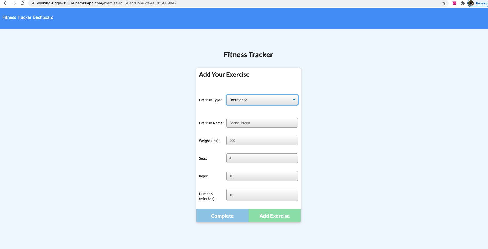
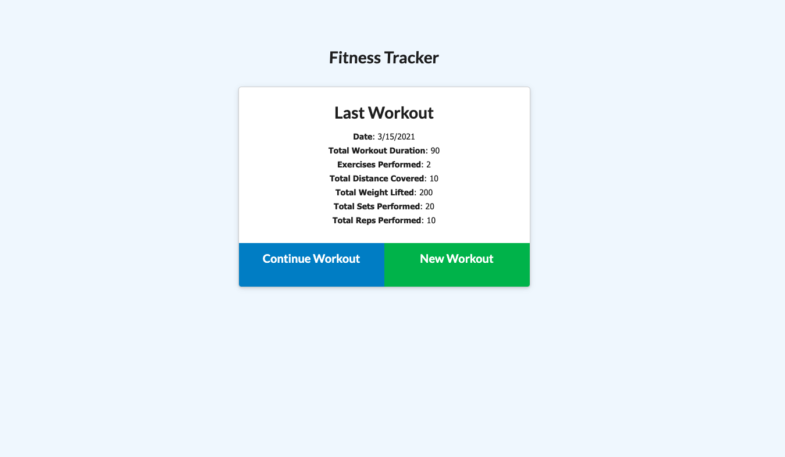
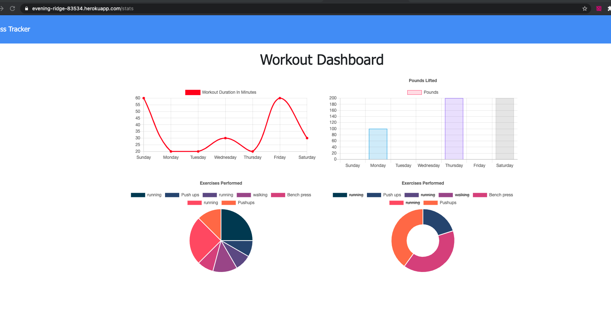

# Fitness Tracker
Track your workouts with Fitness Tracker. The app will keep track of every exercise in your workout. The app dashboard will display weekly summary graphs of all workouts done in a week.

## Installation

1. Clone repository.
2. Check in routes/api-routes and comment in block of code if you want the database to be prepopulated with dummy values
3. npm install
4. node server.js
5. Running seeders/seed.js is optional to have a prepopulated database.

## Technology used 

JS, HTML,CSS
Node JS
Express
MongoDB database 
Routes
Models
heroku

## Heroku app link
https://evening-ridge-83534.herokuapp.com/?id=604f70b567f44e0015069de7

## Screen shots

## Following acceptance criteria has been met. The user is able to 

  * Add exercises to the most recent workout plan.

  * Add new exercises to a new workout plan.

  * View the combined weight of multiple exercises from the past seven workouts on the `stats` page.

  * View the total duration of each workout from the past seven workouts on the `stats` page.